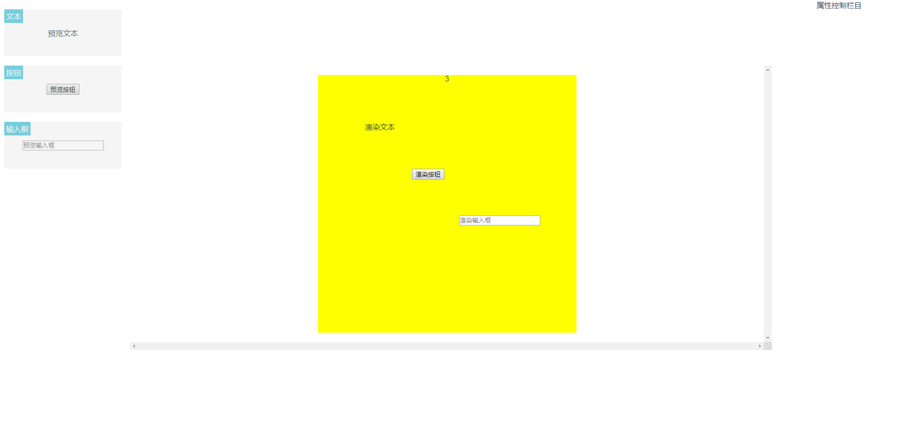

# Vue3+TS+ElementUI 实现低代码平台

**主要技术栈**

  1.Vue3.0
  2.TypeScript
  3.ElementUIPuls

**把项目下到本地**

```
  git clone https://github.com/LIAOJIANS/editor-code-platform.git
```

**装包**

```
  npm i
```

**运行项目**
```
  npm run serve
```

**项目截图**

